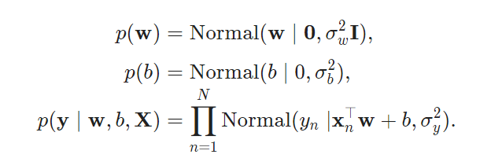
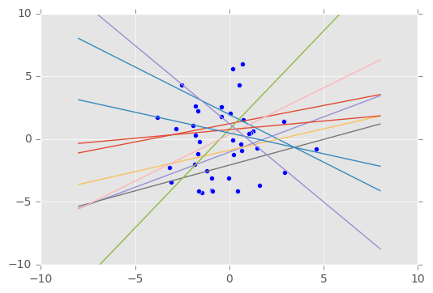
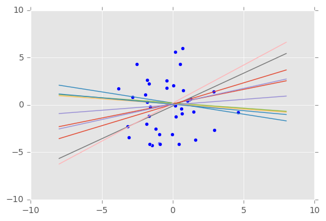

<script type="text/javascript" async
  src="https://cdn.mathjax.org/mathjax/latest/MathJax.js?config=TeX-MML-AM_CHTML">
</script>

# 教程

Edward提供了一个用于快速实验和研究的概率模型的测试平台。这里我们将展示如何将这个过程应用于不同的学习任务。

## 案例

## 贝叶斯线性回归(Bayesian linear regression)

监督学习的基本模式。

在监督学习中，任务是从标注数据中推导隐藏结构。

可交互的[Jupyter Notebook](https://nbviewer.jupyter.org/github/blei-lab/edward/blob/master/notebooks/supervised_regression.ipynb)

```python
from __future__ import absolute_import
from __future__ import division
from __future__ import print_function

import edward as ed
import matplotlib.pyplot as plt
import numpy as np
import tensorflow as tf

from edward.models import Normal
```

### 生成数据

模拟4040个数据点的训练和测试集。他们包括对 $x_n∈R^{10}$ 的输入以及对$y_n∈R$ 的输出。它们与正态分布的噪声(noise)具有一定的线性关系。

```python
def build_toy_dataset(N, w):
  D = len(w)
  x = np.random.normal(0.0, 2.0, size=(N, D))
  y = np.dot(x, w) + np.random.normal(0.0, 0.01, size=N)
  return x, y

ed.set_seed(42)

N = 40  # number of data points
D = 10  # number of features

w_true = np.random.randn(D) * 0.5
X_train, y_train = build_toy_dataset(N, w_true)
X_test, y_test = build_toy_dataset(N, w_true)
```

### 模型

将模型反映为贝叶斯线性回归（Murphy，2012）。 它假设输入$x∈R^D$与输出$y_n∈R$之间有线性关系。



```Python
X = tf.placeholder(tf.float32, [N, D])
w = Normal(mu=tf.zeros(D), sigma=tf.ones(D))
b = Normal(mu=tf.zeros(1), sigma=tf.ones(1))
y = Normal(mu=ed.dot(X, w) + b, sigma=tf.ones(N))
```

在这里，我们定义一个占位符(placeholder)`X`.在inference的过程，我们根据数据传递这个占位符的值。

```python
qw = Normal(mu=tf.Variable(tf.random_normal([D])),
            sigma=tf.nn.softplus(tf.Variable(tf.random_normal([D]))))
qb = Normal(mu=tf.Variable(tf.random_normal([1])),
            sigma=tf.nn.softplus(tf.Variable(tf.random_normal([1]))))
```

使用相对熵运行(Kullback–Leibler divergence)变分推理（这个方法在Edward中很常见），在算法中使用250次迭代和5个潜变量样本。

```python
inference = ed.KLqp({w: qw, b: qb}, data={X: X_train, y: y_train})
inference.run(n_samples=5, n_iter=250)
```

### 评价与检验

评估回归的标准无非就是比较其结果对“testing”数据的预测精度。 

我们可以首先形成后验预测分布：

```
y_post = ed.copy(y, {w: qw, b: qb})
```

其实这个就等于：

```
y_post = Normal(mu=ed.dot(X, qw) + qb, sigma=tf.ones(N))
```

因此，我们可以使用来自我们模型的后验预测来评估各种量。

```
ed.evaluate('mean_squared_error', data={X: X_test, y_post: y_test})
```

妥妥的得到均方误差。

```
## Mean squared error on test data:
## 0.0300492
## Mean absolute error on test data:
## 0.123616
```

训练有素的模型以低误差进行预测（误差精度相对于输出的幅度）。

我们还可以将生成的数据与之前生成的数据（第一个特征维度）做比较，从而可视化拟合，我们来看看结果。

```python
def visualise(X_data, y_data, w, b, n_samples=10):
	w_samples = w.sample(n_samples)[0].eval()
	b_samples = b.sample(n_samples).eval()
	plt.scatter(X_data[:, 0], y_data)
	plt.ylim([-10, 10])
    inputs = np.linspace(-8, 8, num=400)
    for ns in range(n_samples):
        output = inputs * w_samples[ns] + b_samples[ns]
    	plt.plot(inputs, output)

visualise(X_train, y_train, w, b)
```



```
visualise(X_train, y_train, qw, qb)
```



## 线性混合模型

固定和随机效应的线性建模。

利用线性混合效应模型，我们希望对具有不同类型的输入的数据点建立线性关系，分类为子组，并与实值输出相关联。

同时，我们提供Edward对应案例的 [Jupyter Notebook](http://nbviewer.jupyter.org/github/blei-lab/edward/blob/master/notebooks/linear_mixed_effects_models.ipynb) 噢。

### 数据

在这里，我们采用来自[这儿的](https://github.com/blei-lab/edward/blob/master/examples/data/insteval.csv)超人气的[lme4 R包](http://lme4.r-forge.r-project.org/)（Bates，Mächler，Bolker，＆Walker，2015）的InstEval数据集。它是教师评估评估的数据集，其中输入（协变量）包括`学生`和`部门`等类别，我们感兴趣的响应变量是对教师评估值。

首先，我们先处理一下数据：

```python
import pandas as pd
import numpy as np
import edward as ed

data = pd.read_csv('../../examples/data/insteval.csv')
data['dcodes'] = data['d'].astype('category').cat.codes
data['deptcodes'] = data['dept'].astype('category').cat.codes
data['s'] = data['s'] - 1

train = data.sample(frac=0.8)
test = data.drop(train.index)
```

### Acknowledgments

感谢由Mayank Agrawal撰写本教程的初始版本。

### References

Bates, D., Mächler, M., Bolker, B., & Walker, S. (2015). Fitting Linear Mixed-Effects Models Using lme4. *Journal of Statistical Software*, *67*(1), 1–48.

Gelman, A., & Hill, J. L. (2006). *Data analysis using regression and multilevel/hierarchical models*. Cambridge University Press.

## 高斯过程分类

学习分配监督分类功能

## 混合模型

通过聚类数据点来进行的无监督学习。

## 潜在空间模型(Latent space models)

分析神经数据中的地址模式。

## 混合密度网络

用于解决逆问题的神经密度估计器。

## 生成对抗网络

构建MNIST数字的深刻生成模型。

## 概率解码器

信息理论中的潜在代码模型。

## 推理网络

如何摊销training和testing模型的计算

## 贝叶斯神经网络

贝叶斯分析与神经网络。

## 概率PCA

降低潜在变量的维数。

## 更多

如果您有兴趣撰写教程，请查看贡献页面。 有关更多的信息，请参阅下面的材料。

* Probabilistic models
* Inference of probabilistic models
* Variational inference
  * $\text{KL}(q\|p)KL(q∥p)$minimization
  * $\text{KL}(p\|q)KL(p∥q)$ minimization
  * Maximum a posteriori estimation
  * Laplace approximation
* Model criticism

There are also companion webpages for several papers about Edward.

[“Deep probabilistic programming” at ICLR 2017](http://edwardlib.org/tutorials/supervised-regression)

